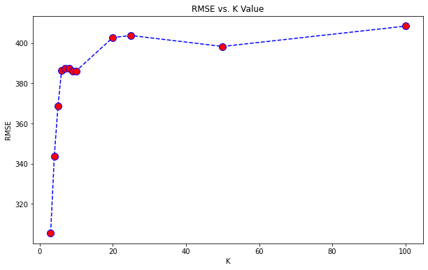
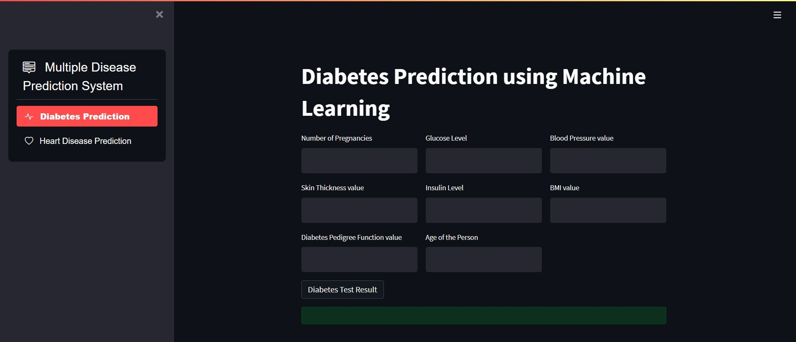

# Mohini_Portfolio
This is a website for all my projects

## [Project 1: House Price prediction: Project overview](https://github.com/saythename1725/House-price-prediction-/blob/main/House%20price%20prediction.ipynb)
* Performed various types of regression techniques to predict the house prices in India.
* Performed EDA and gathered information about the types of houses in different cities, along with extracting features from the dataset.
* Implemented multiple and polynomial linear regression.
* Compared different models.
* Implemented KNN regression.

## [Multiple Disease Prediction System](https://github.com/saythename1725/code.py)
* Built a web app for various diseases using different machine learning models and deployed it using the Streamlit server.

##[Ken's Youtube Dashboard](https://github.com/saythename1725/Ken_Dashboard.py)
 * Extracted desired youtube data using Youtube data API and analyzed it.
 * Built an interactive dashboard for the youtube channel.
 
 
